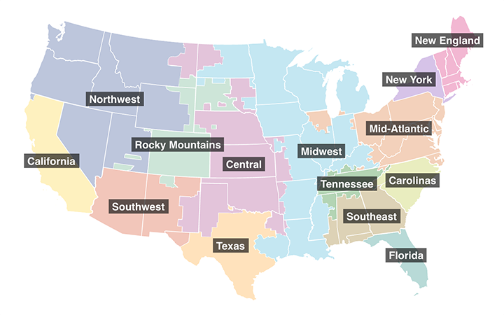

# EPA’s Avoided Emissions and Generation Tool (AVERT)

## Components of AVERT

AVERT is divided into three components:

* **Main Module:** An Excel-based platform for user-specified analysis of emissions impacts. The Regional Data Files are associated with this module. A web edition of the Main Module is also available.
* **Statistical Module:** A MATLAB®-based statistical analysis program.
* **Future Year Scenario Template:** A second Excel-based spreadsheet for creating user-specified future year scenarios. Used in tandem with the statistical file.

## Which modules should I download?
Most users will only need to download AVERT’s Main Module and Regional Data Files. The Main Module estimates emissions impacts resulting from energy efficiency, renewable energy, electric vehicle, and energy storage programs in reference to a historical base year without the Statistical Module and Future Year Scenario Template. However, users who want to model emissions impacts with reference to user-created future years will need to download all three AVERT modules.

## How do I use AVERT?
To use AVERT’s Main Module, open the AVERT Main Module.xlsb file. Ensure that macros are enabled:
* *Windows:* Navigate to the “Trust Center” in the “Options” menu, then select Trust Center Settings > Macro Settings > Enable all macros.
* *Mac OS:* Select “Enable macros” in the dialog box that appears when opening the file.

You can choose your region of analysis on the main screen and upload the relevant regional data file to the tool. Refer to the [AVERT User Manual](docs/avert-user-manual-v4.4-provisional.pdf) for step-by-step instructions on using the Main Module.

## Choosing the right AVERT Region

AVERT uses regional data files to estimate displaced emissions. The contiguous 48 states are split into 14 AVERT regions, which are aggregates of grid balancing authorities. A total of 24 states are split across AVERT boundaries—most across two regions, with the exception of Kentucky, Mississippi, Montana, New Mexico, and South Dakota, which are split across three AVERT regions, and Texas, which is split across four regions. Consult the map below to determine whether your state is split across AVERT boundaries.

For more information, consult the [AVERT User Manual](docs/avert-user-manual-v4.4-provisional.pdf).